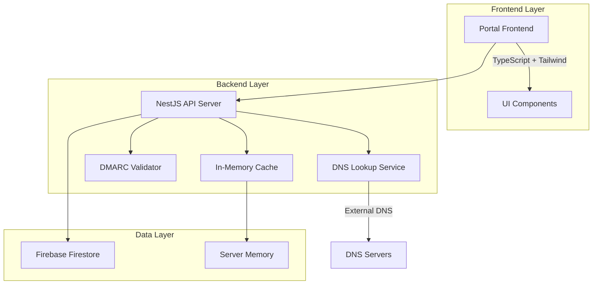

# Design Document: DMARC Portal System

## Overview

The DMARC Portal is a full-stack web application that provides public DMARC record validation services. The system consists of a TypeScript frontend built with modern web technologies and a NestJS backend that performs DNS lookups, validates DMARC records, and manages domain data using Firebase as the persistence layer.

The architecture emphasizes performance through intelligent caching, user experience through clear educational content, and community engagement through a voting system that highlights important domains with DMARC issues.

## Architecture

The system follows a clean three-tier architecture:



**Key Architectural Decisions:**

1. **Separation of Concerns**: Frontend handles presentation and user interaction, backend manages business logic and data validation
2. **Caching Strategy**: Two-level caching with Firebase for persistence and in-memory for performance-critical operations
3. **Stateless Backend**: All persistent state stored in Firebase, temporary state (like vote restrictions) in server memory
4. **DNS Abstraction**: Dedicated service layer for DNS operations to enable testing and future provider switching

## Components and Interfaces

### Frontend Components

**Portal Interface (`PortalFrontend`)**
```typescript
interface PortalFrontend {
  // Domain checking interface
  submitDomain(domain: string): Promise<ValidationResult>
  displayValidationResult(result: ValidationResult): void
  
  // Registry and voting interface  
  displayDomainRegistry(): Promise<DomainEntry[]>
  handleUpvote(domain: string): Promise<void>
  triggerRecheck(domain: string): Promise<ValidationResult>
  
  // Educational content
  displayEducationalContent(): void
}

interface ValidationResult {
  domain: string
  dmarcRecord: string | null
  isValid: boolean
  issues: ValidationIssue[]
  checkTimestamp: Date
}

interface DomainEntry {
  domain: string
  lastChecked: Date
  upvotes: number
  dmarcStatus: 'missing' | 'invalid' | 'weak'
  validationResult: ValidationResult
}
```

### Backend Services

**DMARC Validation Service (`DmarcValidator`)**
```typescript
interface DmarcValidator {
  validateDomain(domain: string): Promise<ValidationResult>
  parseDmarcRecord(record: string): DmarcPolicy
  evaluatePolicy(policy: DmarcPolicy): ValidationIssue[]
}

interface DmarcPolicy {
  version: string
  policy: 'none' | 'quarantine' | 'reject'
  subdomainPolicy?: 'none' | 'quarantine' | 'reject'
  percentage?: number
  reportingAddresses?: string[]
  alignment?: {
    spf: 'relaxed' | 'strict'
    dkim: 'relaxed' | 'strict'
  }
}
```

**DNS Lookup Service (`DnsService`)**
```typescript
interface DnsService {
  lookupDmarcRecord(domain: string): Promise<string | null>
  validateDomainFormat(domain: string): boolean
}
```

**Domain Registry Service (`DomainRegistry`)**
```typescript
interface DomainRegistry {
  // Data persistence
  storeDomainResult(result: ValidationResult): Promise<void>
  getDomainResult(domain: string): Promise<ValidationResult | null>
  
  // Registry management
  listNonCompliantDomains(): Promise<DomainEntry[]>
  removeDomainFromRegistry(domain: string): Promise<void>
  
  // Voting system
  incrementUpvotes(domain: string): Promise<number>
  getUpvoteCount(domain: string): Promise<number>
}
```

**IP Blocking Service (`IpBlocker`)**
```typescript
interface IpBlocker {
  hasVoted(ipAddress: string, domain: string): boolean
  recordVote(ipAddress: string, domain: string): void
  clearAllVotes(): void // Called on server restart
}
```

## Data Models

### Firebase Collections

**Domains Collection (`/domains/{domainId}`)**
```typescript
interface DomainDocument {
  domain: string
  dmarcRecord: string | null
  isValid: boolean
  issues: ValidationIssue[]
  lastChecked: Timestamp
  upvotes: number
  createdAt: Timestamp
  updatedAt: Timestamp
}

interface ValidationIssue {
  type: 'missing_record' | 'syntax_error' | 'weak_policy' | 'alignment_issue'
  severity: 'error' | 'warning' | 'info'
  message: string
  recommendation: string
}
```

### In-Memory Data Structures

**Vote Tracking (Server Memory)**
```typescript
// Using Set for O(1) lookup performance
type VoteKey = `${ipAddress}:${domain}`
const voteRestrictions: Set<VoteKey> = new Set()

// Cache for domain results (TTL-based)
interface CacheEntry {
  result: ValidationResult
  expiresAt: Date
}
const domainCache: Map<string, CacheEntry> = new Map()
```

## Correctness Properties

*A property is a characteristic or behavior that should hold true across all valid executions of a system-essentially, a formal statement about what the system should do. Properties serve as the bridge between human-readable specifications and machine-verifiable correctness guarantees.*

Based on the prework analysis of acceptance criteria, the following properties ensure system correctness:

**Property 1: Domain validation completeness**
*For any* valid domain name submitted to the system, the DMARC Portal should perform format validation, DNS lookup, DMARC record evaluation, and return a complete validation result with appropriate compliance status and detailed explanations.
**Validates: Requirements 1.1, 1.2, 1.4**

**Property 2: Non-compliant domain display accuracy**
*For any* domain in the system, it should appear in the public registry list if and only if it has been checked and found to be non-compliant with DMARC best practices.
**Validates: Requirements 3.1, 3.5**

**Property 3: Domain entry information completeness**
*For any* domain entry displayed in the registry, the interface should include domain name, check date, DMARC status, upvote button, recheck button, and current vote count.
**Validates: Requirements 3.2, 3.4, 4.1, 4.3**

**Property 4: Vote management integrity**
*For any* IP address and domain combination, the system should allow exactly one upvote per IP per domain, increment vote counts correctly on valid votes, and reject duplicate vote attempts from the same IP.
**Validates: Requirements 4.2, 5.1, 5.2**

**Property 5: Registry sorting consistency**
*For any* set of domain entries, the registry should sort them primarily by vote count (descending) and secondarily by check date (most recent first) when vote counts are equal.
**Validates: Requirements 4.4, 4.5**

**Property 6: Cache-first lookup strategy**
*For any* domain validation request, the system should first check its internal cache, return cached results if current, and only perform DNS lookup for cache misses or expired entries.
**Validates: Requirements 6.1, 6.2, 6.3**

**Property 7: DMARC evaluation thoroughness**
*For any* DMARC record found during lookup, the system should evaluate record syntax, policy settings, alignment requirements, and security effectiveness to produce comprehensive validation results.
**Validates: Requirements 6.4**

**Property 8: Data persistence completeness**
*For any* domain validation result, the system should store domain name, DMARC record content, validation status, check timestamp, and upvote count with proper persistence in the database.
**Validates: Requirements 6.5, 8.1, 8.2**

**Property 9: Cache expiration consistency**
*For any* cached domain result, the system should respect configurable expiration periods and treat expired entries as cache misses requiring fresh DNS lookups.
**Validates: Requirements 8.3**

**Property 10: Public accessibility**
*For any* request to the portal endpoints, the system should allow access without requiring authentication or authorization credentials.
**Validates: Requirements 1.5**

**Property 11: Issue explanation completeness**
*For any* domain with DMARC issues, the system should display both the current DMARC record (or indicate if missing) and provide specific explanations of the identified problems.
**Validates: Requirements 1.3**

**Property 12: Detailed validation display**
*For any* domain entry clicked by a user, the system should display comprehensive validation results including all identified issues and explanations.
**Validates: Requirements 3.3**

<function_calls>
<invoke name="prework">
<parameter name="featureName">dmarc-portal

## Error Handling

### DNS Lookup Errors
- **Network timeouts**: Retry with exponential backoff, fallback to cached results if available
- **DNS resolution failures**: Return appropriate error messages distinguishing between domain not found vs. DNS server issues
- **Invalid domain formats**: Validate domain format before DNS lookup, provide clear error messages for malformed domains

### DMARC Record Parsing Errors
- **Malformed records**: Parse what's possible, report specific syntax errors with recommendations
- **Missing required fields**: Identify missing mandatory DMARC tags and suggest corrections
- **Invalid policy values**: Flag invalid policy settings and recommend valid alternatives

### Database Errors
- **Firebase connection issues**: Implement retry logic with circuit breaker pattern
- **Write failures**: Queue operations for retry, maintain data consistency
- **Read failures**: Fallback to DNS lookup if cache read fails, log errors for monitoring

### Rate Limiting and Abuse Prevention
- **Excessive requests**: Implement rate limiting per IP address to prevent abuse
- **Invalid domain flooding**: Detect and throttle repeated invalid domain submissions
- **Vote manipulation**: IP-based restrictions prevent basic vote manipulation attempts

## Testing Strategy

### Dual Testing Approach

The system will use both unit tests and property-based tests to ensure comprehensive coverage:

**Unit Tests** focus on:
- Specific examples of DMARC record parsing and validation
- Edge cases like malformed domains, empty records, and network failures
- Integration points between frontend and backend services
- Firebase data operations and error conditions

**Property-Based Tests** focus on:
- Universal properties that hold across all valid inputs
- Comprehensive input coverage through randomization
- Validation of correctness properties defined in this design

### Property-Based Testing Configuration

**Framework**: [fast-check](https://github.com/dubzzz/fast-check) for TypeScript property-based testing
**Test Configuration**: Minimum 100 iterations per property test
**Test Tagging**: Each property test must reference its design document property using the format:
`// Feature: dmarc-portal, Property {number}: {property_text}`

### Testing Implementation Requirements

1. **Property Test Coverage**: Each correctness property must be implemented as a property-based test
2. **Generator Strategy**: Create smart generators that produce realistic domain names, DMARC records, and IP addresses
3. **Test Data Management**: Use Firebase emulator for testing to avoid affecting production data
4. **Performance Testing**: Separate performance tests for cache efficiency and database query optimization
5. **Integration Testing**: End-to-end tests covering the complete domain validation workflow

### Test Environment Setup

- **Frontend Testing**: Jest with React Testing Library for component tests
- **Backend Testing**: Jest with NestJS testing utilities
- **Database Testing**: Firebase emulator suite for isolated testing
- **Property Testing**: fast-check integrated with Jest test runner
- **CI/CD Integration**: Automated test execution on all pull requests and deployments